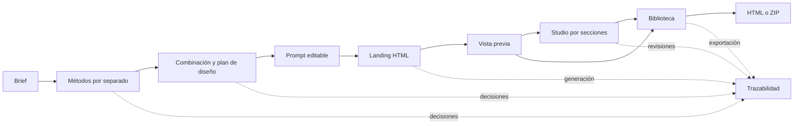

# XPage

**De una idea a una landing que puedes revisar, editar y exportar.** XPage es un estudio local de creación web asistido por [Eve](https://github.com/vercel/eve). Parte de un brief, ejecuta métodos de diseño por separado, combina sus decisiones en un plan, genera HTML y permite intervenir secciones concretas con IA.

> XPage está pensado para ejecutarse en tu computador. No requiere una cuenta de XPage ni publica las páginas generadas. Los modelos y bancos de medios que elijas sí pueden necesitar conexión, cuenta, clave o cuota propia.

[Empezar](#inicio-rápido) · [Recorrido](#recorrido-del-producto) · [Métodos](#ocho-métodos-una-dirección) · [Modelos y medios](#modelos-y-medios) · [Studio](#studio-edición-y-exportación) · [Arquitectura](#arquitectura)

## Qué puedes hacer

| Área | En XPage |
| --- | --- |
| **Planear** | Completar un brief, elegir uno o varios métodos y revisar el aporte de cada uno antes de combinarlos. |
| **Dirigir** | Comparar direcciones creativas, inspeccionar estructura, identidad visual y requisitos del contenido, y editar el prompt final. |
| **Construir** | Generar HTML, CSS y JavaScript independientes mediante Eve; ver la landing dentro de XPage antes de guardarla. |
| **Editar** | Abrir Studio, elegir una sección marcada, pedir una propuesta con IA, comparar el cambio y aplicarlo o descartarlo. |
| **Ilustrar** | Buscar fotos y clips en Pexels o generar una imagen mediante OpenRouter; asignar recursos a espacios del plan. |
| **Rastrear** | Consultar etapas, métodos, prompts, modelos, decisiones, fuentes, revisiones y resultados en trazabilidad. |
| **Conservar** | Guardar en Biblioteca, reabrir una landing, deshacer revisiones y descargar HTML o ZIP con medios y créditos. |

## Recorrido del producto



1. **Define el punto de partida.** Describe tema, oferta, público, objetivo, tono, marca, referencias, restricciones y acción esperada. Puedes orientar variedad, densidad y movimiento.
2. **Ejecuta los métodos.** Cada técnica seleccionada entrega un aporte revisable. Puedes ajustar sus decisiones antes de pedir una combinación.
3. **Elige la dirección.** Eve sintetiza los aportes en un plan con identidad visual, secciones, espacios para medios y requisitos explícitos. Compara las propuestas y corrige el prompt que se enviará a la generación.
4. **Construye y mira.** La landing se abre en una vista previa dentro de XPage. Guardarla en Biblioteca es opcional en este punto.
5. **Itera.** Vuelve al estudio, abre Studio, selecciona una sección y revisa una propuesta de IA. Puedes buscar medios, incorporar los elegidos y consultar la traza.
6. **Conserva y entrega.** Guarda para poder reabrirla después y descarga el resultado. La exportación con medios incluye archivos locales y créditos.

Las páginas generadas usan IDs de sección estables. Así Studio puede modificar un fragmento sin reemplazar el documento completo. La vista previa usa un `iframe` aislado. Las generaciones completas también se pueden recuperar desde **Biblioteca → Sin guardar**, donde sus salidas se leen de las trazas locales. Guardar sigue siendo una decisión explícita; los cambios temporales del editor deben guardarse para conservar esa nueva versión.

## Ocho métodos, una dirección

Las técnicas no son ocho estilos visuales prefijados. Cada una introduce una decisión distinta en el plan; al combinar varias, Eve debe mostrar cómo se complementan y resolver sus tensiones.

| Método | Aporte esperado |
| --- | --- |
| **Cadenas semilla** | Cadena arbitraria para explorar rutas válidas y elegir una dirección concreta; dossier editable con tokens, composiciones, inventario e interacción. |
| **Prompts ambiciosos** | Recorrido narrativo que conecta motivaciones, preguntas y acción. |
| **Creador y crítico** | Propuesta inicial, problemas observables y ajustes justificados. |
| **Activos de imagen** | Imágenes con propósito, composición, texto alternativo y sección de destino. |
| **Activos de vídeo** | Clips con función narrativa, póster, controles y alternativa accesible. |
| **Diseño sustractivo** | Elementos que se retiran o simplifican sin perder información útil. |
| **Restricciones negativas** | Límites de contenido, claims, accesibilidad y datos que no se deben inventar. |
| **Copy humano** | Titulares, texto y llamadas a la acción claros y específicos. |

Las instrucciones de Eve están en [`agent/instructions.md`](agent/instructions.md); cada método tiene su propia skill en [`agent/skills/`](agent/skills/) y la síntesis usa [`combine`](agent/skills/combine/SKILL.md). El diseño parte de seis gramáticas adaptables al brief, más composiciones de sección y un plan `DesignDNA`: consulta la [guía de diseño y atribución](src/lib/design-systems/README.md). XPage investigó el flujo de [OpenDesign](https://github.com/nexu-io/open-design) y adaptó ideas de dirección, composición y crítica a sus contratos; no integra el runtime ni el catálogo completo de plugins de OpenDesign.

El brief manda sobre la receta visual. Cuando pide una cantidad concreta de contenido, XPage la lleva al plan y comprueba que los elementos aparezcan en las secciones del HTML. Si faltan, intenta una reparación acotada y muestra el error si el resultado sigue incompleto.

Las ocho skills y `combine` tienen procedimientos, artefactos editables, ejemplos y criterios de revisión. La [skill de Cadenas semilla v2](agent/skills/seed-strings/SKILL.md) distingue el método [String Seed of Thought](https://arxiv.org/abs/2510.21150) de su adaptación a diseño web. Los [materiales de OpenDesign copiados y atribuidos](agent/skills/seed-strings/references/open-design/README.md) se comparten entre métodos y Eve puede leerlos por fase mediante `read_seed_reference`. La ruta elegida y las ediciones de la persona se conservan durante la combinación y la construcción del HTML; la cadena no se interpreta como una identidad de marca ni como un generador de resultados deterministas. El prompt final desarrolla copy, composición por sección, interacciones, slots y el inventario completo solicitado; las notas internas del brief pertenecen al plan y a la trazabilidad.

## Espacios de trabajo

- **Biblioteca:** tarjetas con vista previa, búsqueda y filtro de tema. Abre **Detalles** para ver la página, su dirección, descarga y proceso; **Studio** continúa la edición. La pestaña **Sin guardar** recupera generaciones completas, conserva su procedencia y permite abrirlas, descargarlas o guardarlas cuando sus metadatos estén completos.
- **Trazabilidad:** carpetas por proceso, con sus ejecuciones relacionadas y acceso a los eventos originales. El estado actual y los errores anteriores permanecen visibles; la agrupación usa los vínculos guardados de cada ejecución.
- **Eve:** conexión y modelo, prueba estructurada editable, catálogo de skills y tools, referencias atribuidas de OpenDesign y sistemas de diseño. Puedes leer las instrucciones y elegir un sistema para la creación. Las referencias del plugin `web-prototype` son materiales de autoría que usa el agente.

El [plan de esta evolución](docs/v3/PLAN.md) documenta el alcance y el reparto de los cambios.

## Studio: edición y exportación

**Vista previa.** La página terminada se muestra dentro de la app. Puedes alternar entre verla y abrir Studio desde la barra superior, o volver al formulario y abrir cualquiera de las dos vistas de nuevo.

**Estructura y código.** Studio permite proponer secciones nuevas con Eve, reordenar las secciones por arrastre o mediante botones y editar HTML, CSS y JavaScript. Las propuestas de código se previsualizan antes de aplicarse; las páginas guardadas conservan revisiones y recuperación de versiones. Las generaciones sin guardar también pueden abrirse en el editor.

**Edición puntual.** Studio trabaja con secciones identificadas por `data-xpage-section`. Selecciona la sección, describe el cambio, elige métodos y compara la propuesta antes de aplicarla. En una landing guardada, las revisiones quedan asociadas a la Biblioteca y puedes deshacer cambios. Una landing antigua sin marcadores válidos sigue siendo visible y descargable, pero no admite esta edición puntual.

**Medios.** Los espacios `data-xpage-slot` conectan una sección del plan con un recurso. Pexels ofrece búsqueda de fotos y clips; OpenRouter permite solicitar una imagen generada. La selección registra origen, autor y enlace de crédito. Los archivos elegidos se conservan localmente cuando la landing está guardada. La generación de vídeo por IA no está incluida.

**Descarga.** Una landing sin medios locales se descarga como HTML. Con medios, XPage prepara un ZIP con `index.html`, archivos bajo `assets/` y `CREDITOS.txt`. Los scripts y estilos de la página no dependen de un CDN. Comprueba los términos del proveedor y la licencia de cada recurso antes de publicar la landing fuera de XPage.

**Trazabilidad.** La vista de trazas relaciona ejecuciones y pasos: entradas, métodos, decisiones resumidas, prompts, proveedor/modelo, resultados, fuentes y revisiones. Registra hechos observables del proceso; no pretende mostrar el razonamiento privado del modelo.

## Modelos y medios

| Servicio | Uso en XPage | Configuración |
| --- | --- | --- |
| ChatGPT mediante Codex | Texto con GPT-5.6 Luna o GPT-6 Luna a través de Eve | Codex CLI y sesión local de ChatGPT |
| Gemini | Texto a través de Eve | Clave de Google |
| Qwen en OpenRouter | Texto a través de Eve | Clave de OpenRouter |
| Pexels | Búsqueda de fotos y clips de stock | Clave de Pexels |
| OpenRouter Image | Generación opcional de imágenes | Clave de OpenRouter y confirmación en Studio |

XPage usa modelos Luna normales, sin variantes *fast*. La disponibilidad, cuota y condiciones de cada modelo dependen de tu cuenta y del proveedor. La imagen generada por OpenRouter es una operación aparte del modelo de texto y puede consumir cuota o tener costo. No hay generación de vídeo.

## Inicio rápido

### Requisitos

- Windows con **Node.js 24 o posterior** y **pnpm 10**.
- Para GPT mediante la suscripción local de ChatGPT, [Codex CLI](https://developers.openai.com/codex/cli) instalado y disponible para XPage.
- Para otros modelos y medios, solo las claves de los servicios que decidas usar.

```powershell
cd xpage
pnpm install
pnpm dev
```

Abre **http://localhost:3000**. `pnpm dev` aplica las migraciones SQLite pendientes e inicia Next.js con Eve. En la parte superior del estudio, elige el modelo. Si vas a usar GPT y Codex aún no tiene sesión, pulsa **Conectar ChatGPT Subscription**: XPage abre el inicio de sesión nativo en el navegador del sistema. Después pulsa **Probar conexión con Eve** para confirmar una generación estructurada. La UI muestra el estado de Codex y la prueba confirma por separado que Eve puede usar el modelo.

Si necesitas diagnosticar el acceso desde la terminal, ejecuta `pnpm eve:dev` y usa `/login`. No pegues URLs de autorización, códigos ni tokens en incidencias o capturas. Las credenciales permanecen en el mecanismo local de Codex; no se copian a `.env.local`.

### Configuración opcional

Copia `.env.example` a `.env.local` y rellena solo los proveedores que usarás:

| Variable | Uso |
| --- | --- |
| `GOOGLE_GENERATIVE_AI_API_KEY` | Generación de texto con Gemini. |
| `GEMINI_MODEL` | ID del modelo Gemini elegido. |
| `OPENROUTER_API_KEY` | Generación de texto con Qwen y generación opcional de imágenes. |
| `OPENROUTER_MODEL` | ID del modelo Qwen en OpenRouter. |
| `OPENROUTER_IMAGE_MODEL` | ID del generador de imagen en OpenRouter. |
| `PEXELS_API_KEY` | Búsqueda de fotos y vídeos de stock. |

Gemini y Qwen se habilitan cuando existe su clave. No pongas claves en variables `NEXT_PUBLIC_*` ni subas `.env.local` a Git. XPage está concebido para uso local; el botón de conexión con Codex funciona en el servidor de desarrollo.

## Arquitectura

```text
xpage/
├─ agent/                 Agente Eve, instrucciones, tools y skills
├─ src/app/               Estudio, vista previa, Biblioteca, trazabilidad y API
├─ src/components/        Formularios, selector de modelo, Studio y medios
├─ src/lib/               Plan de diseño, modelos, medios, revisiones y trazas
├─ prisma/                Esquema, migraciones y SQLite local
├─ data/assets/           Medios descargados o generados (ignorado por Git)
├─ docs/v2/               Planes de evolución y notas de integración
└─ scripts/               Arranque local y utilidades
```

El frontend y las rutas API viven en **Next.js 16 / React 19 / TypeScript**. **Eve** orquesta las generaciones estructuradas y las skills de método. **Prisma + SQLite** conservan landings, trazas, propuestas, revisiones y metadatos de medios. Los archivos binarios se guardan fuera de la base, en `data/assets/`. La búsqueda de Pexels y las llamadas a modelos externos salen del servidor, sin exponer claves al navegador.

XPage genera una landing como `title`, `html`, `css` y `js`. El plan conserva secciones, composición, identidad visual y requisitos de contenido. El servidor verifica marcadores de sección, contenido explícito y sintaxis CSS antes de declarar lista la página. Esto detecta omisiones concretas; no sustituye una revisión humana del texto y del diseño renderizado.

### Datos y respaldo

| Dato | Ubicación local |
| --- | --- |
| Landings, trazas, revisiones y metadatos | `prisma/xpage.db` |
| Fotos, clips e imágenes generadas seleccionadas | `data/assets/` |
| Selección de modelo y borrador de flujo del navegador | Almacenamiento local/de sesión del navegador |

Para respaldar una instalación, cierra XPage y copia **juntos** `prisma/xpage.db` y `data/assets/`. Restaurar solo SQLite conserva referencias y metadatos, pero deja sin archivo los medios asociados. El repositorio no incluye estos datos locales. Consulta [operación e integración](docs/v2/07-integracion-producto.md).

## Comandos

| Comando | Función |
| --- | --- |
| `pnpm dev` | Aplica migraciones e inicia Next.js y Eve en desarrollo. |
| `pnpm eve:dev` | Abre la terminal de Eve para diagnóstico y `/login`. |
| `pnpm build` | Compila la aplicación. |
| `pnpm start` | Inicia el build de Next.js; la conexión de Codex desde la UI está prevista para `dev`. |
| `pnpm lint` | Revisa el código con ESLint. |
| `pnpm typecheck` | Comprueba los tipos TypeScript. |
| `pnpm db:migrate` | Crea una migración de desarrollo con Prisma. |
| `pnpm db:studio` | Abre Prisma Studio para inspeccionar SQLite. |

## Límites actuales

- XPage se ejecuta localmente y **no ofrece publicación ni sincronización en la nube**.
- Busca vídeos de stock, pero **no genera vídeo**.
- La edición puntual con IA requiere marcadores de sección válidos. El editor de código permite revisar el documento completo; para reordenar, las secciones deben estar al mismo nivel del HTML.
- Los modelos pueden omitir detalles visuales o devolver resultados débiles. Los contratos detectan requisitos explícitos y fallos estructurales, pero el resultado final necesita revisión editorial y visual.
- Biblioteca recupera las salidas HTML completas de las trazas. Las ediciones temporales posteriores necesitan guardado explícito; los registros antiguos con metadatos ausentes requieren completar esos datos para guardarlos.

## Referencias

- [Eve y sus skills](https://github.com/vercel/eve) · [OpenDesign, referencia de flujo creativo](https://github.com/nexu-io/open-design)
- [Planes de XPage v2](docs/v2/00-sinopsis.md) · [Sistema visual y atribución](src/lib/design-systems/README.md)

---

**XPage** convierte métodos de diseño en decisiones revisables y páginas editables, con los archivos y el historial bajo tu control local.
